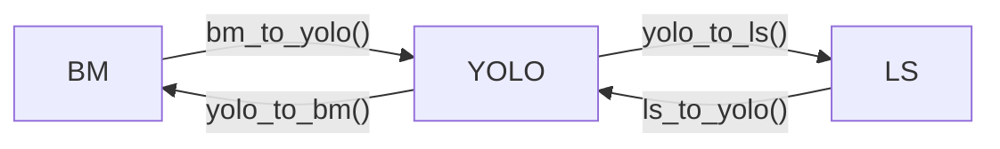

# AgribotTools

## Converter

### Acronyms and Definitions

| Acronym | Definition | Brief description |
| ------- | ---------- | ----------------- |
| LS | **Label Studio** | The software used for labeling. |
| UL | **Ultralytics** | Target library for object detection and segmentation. |
| Binmask | **Binary mask** | Binary image where a $1$ represents a foreground pixel, while a $0$ represents a background pixel. |
| Segmask | **Segmentation mask** | Mask used to highlight an object of interest. |
| Bbox | **Bounding box** | Box that highlights an object of interest. |

### Format Definition

##### BinMask format

It is a folder containing:

* A subfolder `images` containing the labelled images in `jpg` or `png` format.
* A subfolder `labels` containing, for each image in the `images` subfolder, a `png` image describing the segmask associated with the corresponding image.

##### YOLO format

It is a folder containing:

* A subfolder `images` containing the labelled images in `jpg` or `png` format.
* A subfolder `labels` containing, for each image in the `images` subfolder, a text file with the same name as the corresponding image, in which each row describes a segmask or a bbox in the following format:
 ```
 <class_id><x1><y1><x2><y2>...<xn><yn>
 <class_id><x_center><y_canter><width><height>
 ```
* A text file `classes.txt` highlighting the labelled classes, in which each row contains a single string with the name of the corresponding class. Each row's index represents the class's identifier in the `class_id` field of the text file contained in `labels`.

##### LS format

It is a folder containing:

* A subfolder `images` containing the labelled images in `jpg` or `png` format.
* A file in `JSON` format containing information about images and their labels.
* A file in `XML` format for the configuration of the labelling interface:
 ```xml
   <View>
      <!-- View the image to be labelled -->
      <Image name="image" value="$image" />
      <!-- Define the bbox's label -->
      <Labels name="label" toName="image">
         <Label value="Object" />
      </Labels>
      
      <!-- Tool for drawing bboxes -->
      <RectangleLabels name="bbox" toName="image">
         <Label value="Object" />
      </RectangleLabels>
   </View>
 ```

##### UL format

It is a folder named as the dataset, e.g., `xylella`, containing:

* A `train` subfolder containing the portion of the dataset where training data will be stored, including:
   * A subfolder `images` containing the images in `jpg` or `png` format.
   * A subfolder `labels` containing the corresponding labels in YOLO format for each image in `images`.
* A `val` subfolder containing the portion of the dataset where validation data will be stored, including:
   * A subfolder `images` containing the images in `jpg` or `png` format.
   * A subfolder `labels` containing the corresponding labels in YOLO format for each image in `images`.
* An optional `test` subfolder containing the portion of the dataset where testing data will be stored, including:
   * A subfolder `images` containing the images in `jpg` or `png` format.
   * A subfolder `labels` containing the corresponding labels in YOLO format for each image in `images`.
* A configuration file in `yaml` format with the same name of the dataset formatted as follows:
 ```yaml
   # Dataset name
   path: /path/to/dataset        # Path of the dataset
   train: /train/images          # Path of training images (relative to path)
   val: /val/images              # Path of validation images  (relative to path)
   test: /test/images            # Path of test images (relative to path, optional)

   # Classes names
   names:
      0: first class
      1: second class
      ...
 ```

> **Note**: the `train`, `val`, and `test` subfolders share the same structure.

### Use cases

#### Object detection bounding boxes

##### Convert binary masks to Label Studio format



##### Edit segmentation masks on Label Studio

1. Import the dataset on Label Studio using the module `binmask_to_ls`.
2. Edit the segmentation masks.

##### Edit bounding boxes on Label Studio

1. Import the dataset on Label Studio:
 a. Using the `binmask_to_ls` module if the labels are in the binmask format.
 b. Using the model `seg_ls_to_bbox_ls` if the labels are segmasks in LS format.
 c. Directly from the dataset saved in the root folder.
2. Edit bboxes.

##### Convert LS labels in a UL dataset

1. Select JSON as export type.
2. Convert from the LS to the UL format using the `ls_to_ul` module.

## References

* [Ultralytics - Object Detection Datasets Overview](https://docs.ultralytics.com/datasets/detect/)
* [Ultralytics - Instance Segmentation Datasets Overview](https://docs.ultralytics.com/datasets/segment/)
* [Label Studio - Understanding the Label Studio JSON format](https://labelstud.io/blog/understanding-the-label-studio-json-format/#breaking-down-the-label-studio-json-format)
* [Label Studio - Labeling configuration](https://labelstud.io/templates/named_entity#Labeling-Configuration)