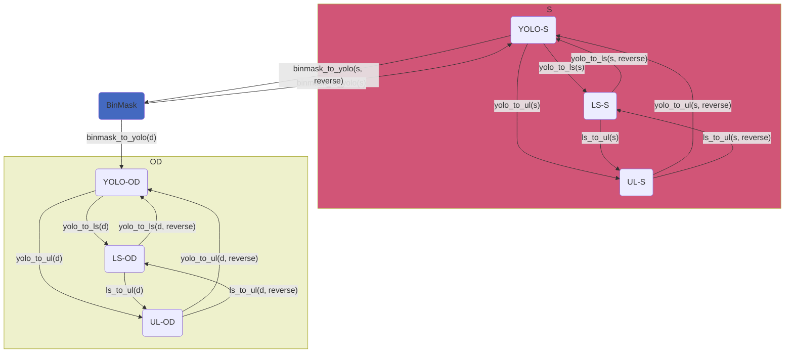

# AgribotTools

## Setup

### Installation

To install AgribotTools, you can clone the repository and install it in editable mode:

```bash
git clone https://github.com/LambdaLekter/AgribotTools.git
cd AgribotTools
pip install -e .
```

Note: we recommend using a virtual environment.  
This will install all the required dependencies.

### Usage

You can use the provided scripts in the `scripts` folder to convert datasets between different formats.  
For example, to convert a dataset from YOLO format to Label Studio format, you can use the following command:

```bash
python scripts/yolo_to_ls.py seg /mnt/c/Dataset/yolo_dir_path --ls_base_name ls_dir_name
```

For more information on the available scripts and their usage, you can run:

```bash
python scripts/<script_name>.py -h
```

### Label Studio
If Label Studio is not installed, you can do so by following the [official guide](https://labelstud.io/guide/install.html).

> #### ⚠️ Setting up the environment variables
> Make sure to correctly configure the following environment variables on the system that executes AgribotTools:
> - `LABEL_STUDIO_LOCAL_FILES_SERVING_ENABLED` (this should be set to `true`)
> - `LABEL_STUDIO_LOCAL_FILES_DOCUMENT_ROOT` (this should be set to the path of the __Label Studio Document Root__)  
>
> The __Label Studio Document Root__ is the folder where all the datasets in Label Studio format are stored
> (see [below](#ls-format)).  
> These environment variables allow to access and locate the local files that we need to import in Label Studio.
> > For example, when importing the binary masks, we need to place the corresponding images in a local storage
> > located under the __Label Studio Document Root__.
> 
> If needed, using a `.env` file placed in the root directory of AgribotTools is also supported.

## Acronyms and Definitions

### Tasks

| Acronym | Explanation                                                                                                         |
|---------|---------------------------------------------------------------------------------------------------------------------|
| LS      | **Label Studio**: the software used for labeling.                                                                   |
| UL      | **Ultralytics**: target library for object detection and segmentation.                                              |
| Binmask | **Binary mask**: binary image where a $1$ represents a foreground pixel, while a $0$ represents a background pixel. |
| Segmask | **Segmentation mask**: mask used to highlight an object of interest.                                                |
| Bbox    | **Bounding box**: box used to highlight an object of interest.                                                      |

| Acronym | Definition           | Brief description         |
|---------|----------------------|---------------------------|
| S       | **Segmentation**     | A segmentation task.      |
| OD      | **Object detection** | An object detection task. |

### Formats

| Acronym | Definition       | Brief description                                            |
|---------|------------------|--------------------------------------------------------------|
| BinMask | **Binary mask**  | Segmentation mask for several classes in a grayscale format. |
| YOLO    | **YOLO format**  | Standard YOLOv1-v3 format.                                   |
| LS      | **Label Studio** | Format used by Label Studio.                                 |
| UL      | **Ultralytics**  | Format used by Ultralytics.                                  |

## Formats Definition

### BinMask format

It is a folder structured as follows.

* A subfolder `images` containing the labelled images in `jpg` or `png` format.
* A subfolder `labels` containing, for each image in the `images` subfolder, a `png` image describing the segmask associated with the corresponding image.
* A `classes.txt` file describing the classes contained in the binary mask.
   
The structure can be summarised as follows:

```
binmask_dset
|---images
|-------img_01.png
        ...
        img_n.png
|---labels
|-------img_01.png
        ...
        img_n.png
|---classes.txt
```

### YOLO format

It is a folder containing:

* A subfolder `images` containing the labelled images in `jpg` or `png` format.
* A subfolder `labels` containing, for each image in the `images` subfolder, a text file with the same name as the corresponding image, in which each row describes a segmask or a bbox in the following format:
 ```
 <class_id><x1><y1><x2><y2>...<xn><yn>
 <class_id><x_center><y_canter><width><height>
 ```
* A text file `classes.txt` highlighting the labelled classes, in which each row contains a single string with the name of the corresponding class. Each row's index represents the class's identifier in the `class_id` field of the text file contained in `labels`.

The structure can be summarised as follows:

```
yolo_dset
|---images
|-------img_01.png
        ...
        img_n.png
|---labels
|-------img_01.txt
        ...
        img_n.txt
|---classes.txt
```

> **Note**: the YOLO format can be used for segmentation and object detection according to the labels' structure.

### LS format

It is a folder containing:

* A subfolder `images` containing the labelled images in `jpg` or `png` format.
* A file in `JSON` format containing information about images and their labels.
* A file in `XML` format for the configuration of the labelling interface:
  ```xml
    <View>
       <!-- View the image to be labelled -->
       <Image name="image" value="$image" />
       <!-- Define the bbox's label -->
       <Labels name="label" toName="image">
          <Label value="Object" />
       </Labels>
       
       <!-- Tool for drawing bboxes -->
       <RectangleLabels name="bbox" toName="image">
          <Label value="Object" />
       </RectangleLabels>
    </View>
  ```

The structure can be summarised as follows:

```
ls_dset
|---images
|-------img_01.png
        ...
        img_n.png
|---info.json
|---info.xml
```

> **Note**: the LS format can be used for segmentation and object detection according to the labels' structure.

> **Note**: Label Studio only supports JSON task files up to 250.000 tasks or 50 MB. If you need to import bigger files,
> the utility `scripts/import_tasks_ls.py` is able to chunk the files and upload them separately on a local instance of
> Label Studio.

### UL format

It is a folder named as the dataset, e.g., `xylella`, containing:

* A subfolder `images` containing the images in `jpg` or `png` format, split in three subfolders:
  * A subfolder `train` containing the training images.
  * A subfolder `val` containing the validation images.
  * An optional subfolder `test` containing the test images.
* A subfolder `labels` containing, for each image in `images`, the corresponding labels in YOLO format, split in three subfolders:
  * A subfolder `train` containing the training labels.
  * A subfolder `val` containing the validation labels.
  * An optional subfolder `test` containing the test labels.
* A configuration file in `yaml` format with the same name of the dataset formatted as follows:
   ```yaml
   # Dataset name
   path: /path/to/dataset        # Path of the dataset
   train: /train/images          # Path of training images (relative to path)
   val: /val/images              # Path of validation images  (relative to path)
   test: /test/images            # Path of test images (relative to path, optional)

   # Classes names
   names:
      0: first class
      1: second class
      2: ...
   ```

The structure can be summarised as follows:

```
ul_dset
|---train
|-------images
|-----------img_01.png
            ...
            img_n.png
|-------labels
|-----------img_01.txt
            ...
            img_n.txt
|---val
|-------images
|-----------img_01.png
            ...
            img_n.png
|-------labels
|-----------img_01.txt
            ...
            img_n.txt
|---test
|-------images
|-----------img_01.png
            ...
            img_n.png
|-------labels
|-----------img_01.txt
            ...
            img_n.txt
|---ul_dset.yaml
```

> **Note**: the `train`, `val`, and `test` subfolders share the same structure.

> **Note**: the UL format can be used for segmentation and object detection according to the labels' structure.

## Converters

| Input format | Output format | Description                                        | Implemented by             | Tasks |
|--------------|---------------|----------------------------------------------------|----------------------------|-------|
| BinMask      | YOLO          | Converts from binary masks to the YOLO format.     | `binmask_to_yolo()`        | S/OD  |
| YOLO         | BinMask       | Converts from the YOLO to the binary masks format. | `binmask_to_yolo(reverse)` | S     |
| YOLO         | UL            | Converts from the YOLO to the UL format.           | `yolo_to_ul()`             | S/OD  |
| UL           | YOLO          | Converts from the UL to the YOLO format.           | `yolo_to_ul(reverse)`      | S/OD  |
| YOLO         | LS            | Converts from the YOLO to the LS format.           | `yolo_to_ls()`             | S/OD  |
| LS           | YOLO          | Converts from the LS to the YOLO format.           | `yolo_to_ls(reverse)`      | S/OD  |
| LS           | UL            | Converts from the LS to the UL format.             | `ls_to_ul()`               | S/OD  |
| UL           | LS            | Converts from the UL to the LS format.             | `ls_to_ul(reverse)`        | S/OD  |

## Workflow



## References

* [Ultralytics - Object Detection Datasets Overview](https://docs.ultralytics.com/datasets/detect/)
* [Ultralytics - Instance Segmentation Datasets Overview](https://docs.ultralytics.com/datasets/segment/)
* [Label Studio - Understanding the Label Studio JSON format](https://labelstud.io/blog/understanding-the-label-studio-json-format/#breaking-down-the-label-studio-json-format)
* [Label Studio - Labeling configuration](https://labelstud.io/templates/named_entity#Labeling-Configuration)
