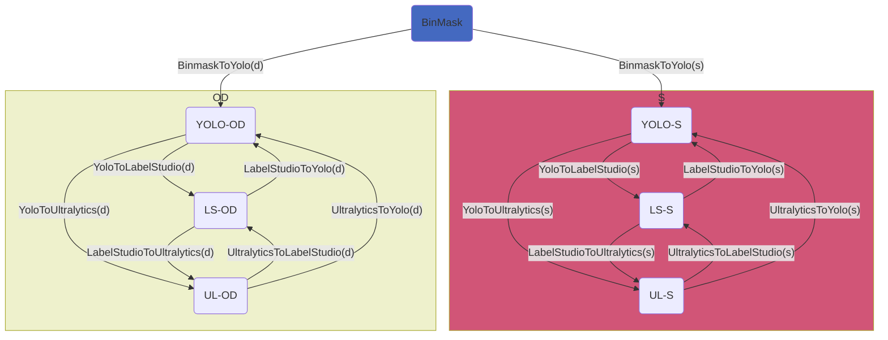

# AgribotTools

[](https://ispstiima.github.io/AgribotTools/)
[](LICENSE.md)
[](https://www.python.org/downloads/)

**Utilities to convert datasets between Label Studio, YOLO and Ultralytics formats.**

AgribotTools is a Python toolkit developed by [CNR STIIMA](https://www.stiima.cnr.it/) for converting computer-vision annotation datasets across popular formats used in object detection and segmentation tasks.


## Features

- **Format conversion** — Seamless conversion between Binary Mask, YOLO, Label Studio, and Ultralytics formats.
- **Validation** — Automatic dataset structure validation before conversion.
- **Gradio GUI** — Web-based graphical interface for point-and-click conversions.
- **CLI scripts** — Ready-to-use command-line scripts for each conversion.
- **Extensible architecture** — Add new formats and conversions via decorators.


## Installation

First, clone the repository and install the dependencies using uv:
```bash
git clone https://github.com/ispstiima/AgribotTools.git
cd AgribotTools
uv sync
```

(Optional) For easier data access for both CLI and GUI, consider creating a symbolic link named `data` pointing to your dataset root:
```bash
ln -s /path/to/dataset data
```

## Usage

### CLI

```bash
# Example: Convert YOLO segmentation to Label Studio format
uv run scripts/yolo_to_ls.py seg /path/to/yolo_dataset --ls_path /path/to/ls_dataset
```
> Note: if you created the dataset symlink, you can use `data/dataset` instead of `/path/to/dataset`.

### GUI

```bash
# Start the GUI (assuming you are in the AgribotTools repository root)
uv run gui.py
```

## Conversion Workflow




## Documentation

📖 **Full documentation** is available at **[ispstiima.github.io/AgribotTools](https://ispstiima.github.io/AgribotTools/)**, including:

- [Getting Started](https://ispstiima.github.io/AgribotTools/getting-started/) — Installation and environment setup
- [Formats](https://ispstiima.github.io/AgribotTools/formats/overview/) — Detailed format specifications
- [Conversions](https://ispstiima.github.io/AgribotTools/conversions/overview/) — Conversion matrix and usage guide
- [GUI](https://ispstiima.github.io/AgribotTools/gui/usage/) — Gradio interface documentation
- [API Reference](https://ispstiima.github.io/AgribotTools/api/formats/) — Python API documentation
- [Contributing](https://ispstiima.github.io/AgribotTools/contributing/) — How to extend AgribotTools


## References

* [Ultralytics - Object Detection Datasets Overview](https://docs.ultralytics.com/datasets/detect/)
* [Ultralytics - Instance Segmentation Datasets Overview](https://docs.ultralytics.com/datasets/segment/)
* [Label Studio - Understanding the Label Studio JSON format](https://labelstud.io/blog/understanding-the-label-studio-json-format/#breaking-down-the-label-studio-json-format)
* [Label Studio - Labeling configuration](https://labelstud.io/templates/named_entity#Labeling-Configuration)


## License

This project is licensed under the MIT License — see [LICENSE.md](LICENSE.md) for details.
