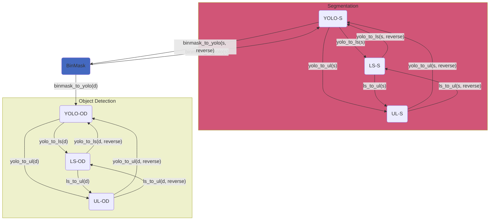

# Conversions Overview

AgribotTools supports **bidirectional conversions** between all four annotation formats, with YOLO acting as the central interchange hub.

---

## Conversion Matrix

| Input Format | Output Format | Function | Tasks |
|:---:|:---:|---|:---:|
| BinMask | YOLO | `binmask_to_yolo()` | S / OD |
| YOLO | BinMask | `binmask_to_yolo(reverse)` | S |
| BinMask | Label Studio | `binmask_to_ls()` | S / OD |
| YOLO | Label Studio | `yolo_to_ls()` | S / OD |
| Label Studio | YOLO | `yolo_to_ls(reverse)` | S / OD |
| YOLO | Ultralytics | `yolo_to_ul()` | S / OD |
| Ultralytics | YOLO | `yolo_to_ul(reverse)` | S / OD |
| Label Studio | Ultralytics | `ls_to_ul()` | S / OD |
| Ultralytics | Label Studio | `ls_to_ul(reverse)` | S / OD |

**Tasks**: S = Segmentation, OD = Object Detection.

---

## Conversion Workflow

The following diagram shows all available conversion paths:

---

## Key Concepts

<!-- ### Reversible Conversions

Many conversions in AgribotTools are **reversible** — a single converter class can perform both forward and reverse transformations. This is implemented via the `ReversibleConversion` base class. -->

### Validation

Before any conversion runs, AgribotTools **automatically validates** the source dataset structure to catch issues early (missing folders, wrong file types, etc.).

### Rollback

If a conversion fails mid-way, AgribotTools automatically **rolls back** any partially created files and directories to keep your filesystem clean.
